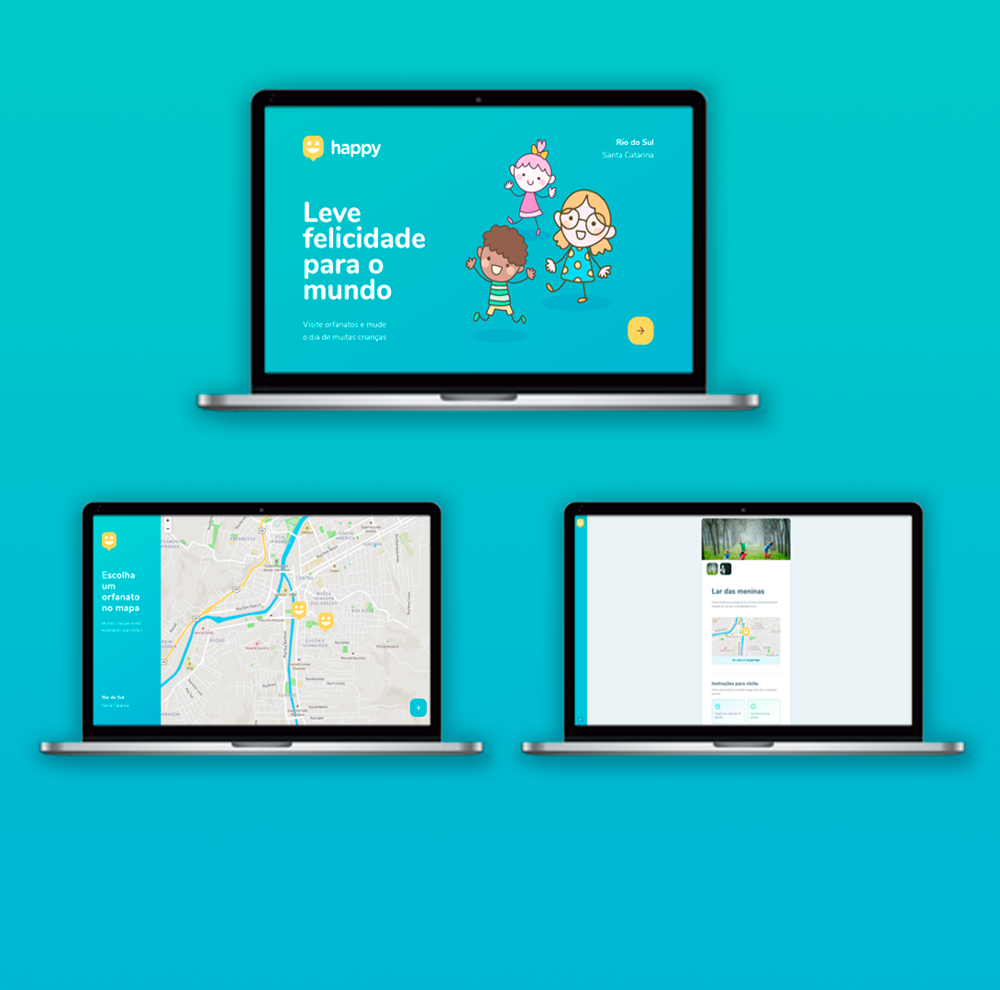
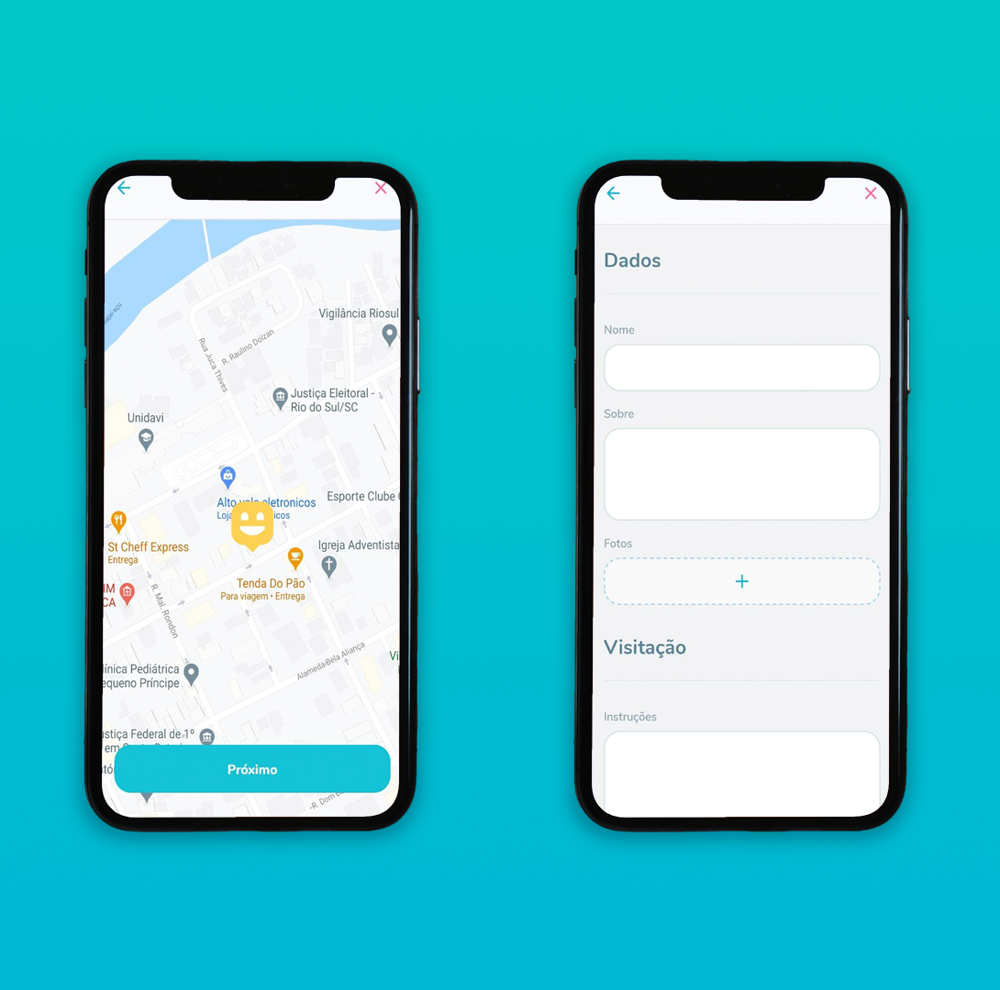

<h1 align="center"> 
    
</h1>

<h1 align="center"> 
    
</h1>


# 💻 Sobre o projeto
A plataforma **Happy** tem como objetivo cadastrar casas de acolhimento institucional, para que assim, de forma fácil, as pessoas consigam localizar essas casas, e então marcar uma visita para as crianças, fazendo a felicidade das mesmas. Através de um formulário é possível cadastrar novas instituições na nossa plataforma, dessa forma, é possível buscar a instituição mais próxima.

Projeto desenvolvido durante a 🚀 **NLW #03 - Next Level Week** 🚀 - Oferecida pela **Rocketseat**

---

# 📱 Versão Mobile

<h1 align="center"> 
    
</h1>

---

## 🚀 Tecnologias utilizadas
 - [Express](https://expressjs.com/)
 - [HTML](https://developer.mozilla.org/pt-BR/docs/Web/HTML)
 - [CSS](https://developer.mozilla.org/pt-BR/docs/Web/CSS)
 - [TypeScript](https://www.typescriptlang.org/)
 - [Node](https://nodejs.org/en/)
 - [ReactJS](https://pt-br.reactjs.org/)
 - [React Native](https://reactnative.dev/)
 - [Expo](https://expo.io/)

---

## 🚨 Como baixar o projeto
Antes de começar, você vai precisar ter instalado em sua máquina as seguintes ferramentas: Git, Node.js. Além disto ter um editor para trabalhar com o código como VSCode.

### 🏁 Para rodar a aplicação 

```bash

    # Clonar o repositório
    $ git clone https://github.com/milealmeida/nlw-omnistack-happy

    # Entrar no diretório
    $ cd back

    # Instalar as dependências
    $ npm install

    # Iniciar o projeto
    $ npm dev

    # Entrar no diretório (após iniciar o backend, executar um projeto por vez, ou o web ou o mobile)
    $ cd web

    # Instalar as dependências
    $ yarn install

    # Iniciar o projeto
    $ yarn start

    # Entrar no diretório (para executar o projeto mobile, é necessário ter o expo instalado)
    $ cd mobile

    # Instalar as dependências
    $ yarn install

    # Iniciar o projeto
    $ expo start

```

---
Desenvolvido por Milena Almeida 💙